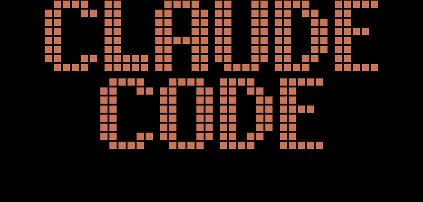

<!-- _class: lead
backgroundColor: black
color: #fff
-->

# Accelerating Go Development<br />with Claude Code


<small style="font-size:25px">Wojciech Barczynski</small>

---

<!-- _class: lead
color: #000
colorSecondary: #333
backgroundColor: #fff
-->

## Development with AI

- AI boosts productivity.
- Tools and models evolve rapidly.
- The challenge is to find what works.

---

<!-- _class: lead -->

## Goal

- Share a pragmatic AI workflow for Go development.
- Discuss effective strategies and tools.

---

<!-- _class: lead -->


---

<!-- _class: lead -->

<p size="30"><b>+ Tools</b></p>

---

<!-- _class: lead -->

## Models

- Anthropic models lead
- `claude` &#8594; better results
- [Cut-off](https://docs.anthropic.com/en/docs/about-claude/models/overview) - march 2025

---

<!-- _class: lead -->

## Models

Models have strengths and weaknesses:

- Claude Code
- Gemini

---

<!-- _class: lead -->

## Context


---

<!-- _class: lead -->

## CLAUDE.md

- Keep it up-to-date.
- Update it when new features are added.
- Create a command for easy updates.

---

<!-- _class: lead -->

## CLAUDE.md

For Go-specific context, include:

- Project coding conventions.
- Go design patterns, with examples (e.g., for error handling).

---

<!-- _class: lead -->

## Plan.md

- Keep the model on track.
- When in doubt, create it.
- A must for anything more complicated.
- Benefits for the model.
- From scratch or based your input/initial plan.

---

<!-- _class: lead -->

## Plan.md

1. Improve the Plan.md
2. Ask Claude to open a PR for step 1
3. Ask Claude to do the implementation
4. Iterate with Claude on code/plan/...
5. Ask Claude to update docs/CLAUDE.md
6. Mark ✅ completed tasks
7. Squash & Merge
8. Clear context
9. Repeat

---

<!-- _class: lead -->

## context7 mcp

- Fetches on-demand documentation and code snippets.
- Additionally:
  - Add links to [prompts](https://github.com/wojciech12/local_grafana_observability_stack).
  - Add information to `memory/`.
  - Or save to `docs-ai/`.

---

<!-- _class: lead -->

## .claude/memory

Memory (`.claude/memory`):

- Convention, not automatically read ([docs](https://docs.anthropic.com/en/docs/claude-code/memory)).
- Use for one-off prompts (e.g., `migration_sqlite_to_psql.md`).
- Store best practices.
- Save prompts for future use (e.g., `memory-template`).

---

<!-- _class: lead -->

## docs-ai / ai-docs

- More extensive docs and larger mds.
- You can link them in `CLAUDE.md`.

---

<!-- _class: lead -->

## Code structure / Repository

1. Vertical code structure ☀️
2. Modular design
3. Layered architecture / numerous dependencies 💀

`CLAUDE.md` in subfolders.

---

<!-- _class: lead -->

## Context

```
Read .claude/memory/* and ... use command ...
```

---

<!-- _class: lead -->

## context hygiene

Once the task is complete or a session is too-long:

- Save any essential information
- Clear the context using the `/clear` command
- `git worktree` for isolated environments
- `/context`

---

<!-- _class: lead -->

## subagents

```markdown
---
name: your-sub-agent-name
description: Description of when this subagent should be invoked
tools: tool1, tool2, tool3  # Optional - inherits all tools if omitted
model: sonnet  # Optional - specify model alias or 'inherit'
---

Your subagent's system prompt goes here.
```

---

<!-- _class: lead -->

## subagents

Examples:

- Frontend
- Code Reviewer
- Project Mgmt
- Various tools to manage them, e.g., [ccagents](https://github.com/Bitropy/ccagents)

---

<!-- _class: lead -->

## Prompt for Claude Code

- The CLEAR Framework
- Keywords, e.g., exactly, detaile, [...](https://github.com/wojciech12/notes_ai_for_software_engineering/blob/main/PROMPTS.md)
- Role-task format pattern

  ```
  You are a [ROLE] with expertise in [DOMAIN].
  Your task is to [SPECIFIC_ACTION].
  ```

---

<!-- _class: lead -->

## The CLEAR Framework

- Context: Background information
- Limitations: Constraints and boundaries
- Examples: Sample inputs/outputs
- Action: Specific task to perform
- Result: Expected deliverable format

---

<!-- _class: lead -->


Will help:

- Good to watch 1-2 videos about prompt engineering
- [prompt optimizer](https://docs.anthropic.com/en/docs/build-with-claude/prompt-engineering/prompt-improver) at claude.ai
- Claude can review your prompts as well.

---

<!-- _class: lead -->

## Claude Code

- **`ESC`**: Provide additional information.
- **`ESC` `ESC`**: Cancel the current action.
- **Planning Mode**: Deconstruct complex tasks into smaller steps.

---

<!-- _class: lead -->
<!-- _class: lead -->

## Claude Code Tools

- **Hooks**: Customize behavior with pre/post-action scripts.
- **OpenTelemetry**: Integrated for observability and performance monitoring.
- **`ccusage`**: CLI tool to track token usage and costs.

---

<!-- _class: lead -->

## Choosing Your Tools

How I approach it:

1. **CLI Tools (`gh`, `eza`, ...):** Fast and efficient for common tasks.
2. **Python Scripts (with `uv`)**: Best for automation and complex logic.
3. **Mcp** few use cases.

---

<!-- _class: lead -->

## Go-Specific

Claude benefits from Go's rapid feedback loop:

- **Strongly-typed language**: Catches errors before runtime.
- **Strict formatting**: Enforced by tools like `gofmt` and `golangci-lint`.

I typically use [Claude hooks](https://github.com/wojciech12/template_project_go/blob/master/.claude/settings.json#L4) to automate these checks.

---

<!-- _class: lead -->

## Accelerating Go Development

- Continuous Process

---

<!-- _class: lead -->

## Accelerating Go Development

- Share the learnings with your team
- e.g., AI retrospectives

---

<!-- _class: lead -->

## Accelerating Go Development

- More verticals in your app, the easier for the model

---

<!-- _class: lead -->

## Accelerating Go Development

- Model
- Context
- Prompt
- Tools

---

<!-- _class: lead -->
<h1>Demo &rarr; Claude</h1>

[github.com/wojciech12/talks](https://github.com/wojciech12/talks/) & [wbarczynski.pl](https://wbarczynski.pl)

---

<!-- _class: lead -->

# Thank you


---

<!-- _class: lead -->

# Backup Slides

---

<!-- _class: lead -->

# Prompt Enginering

- [Prompt Best Practices](https://docs.anthropic.com/en/docs/build-with-claude/prompt-engineering/be-clear-and-direct)
- [Prompt library](https://docs.anthropic.com/en/resources/prompt-library/corporate-clairvoyant)
- [CO-STAR](https://towardsdatascience.com/how-i-won-singapores-gpt-4-prompt-engineering-competition-34c195a93d41/)
